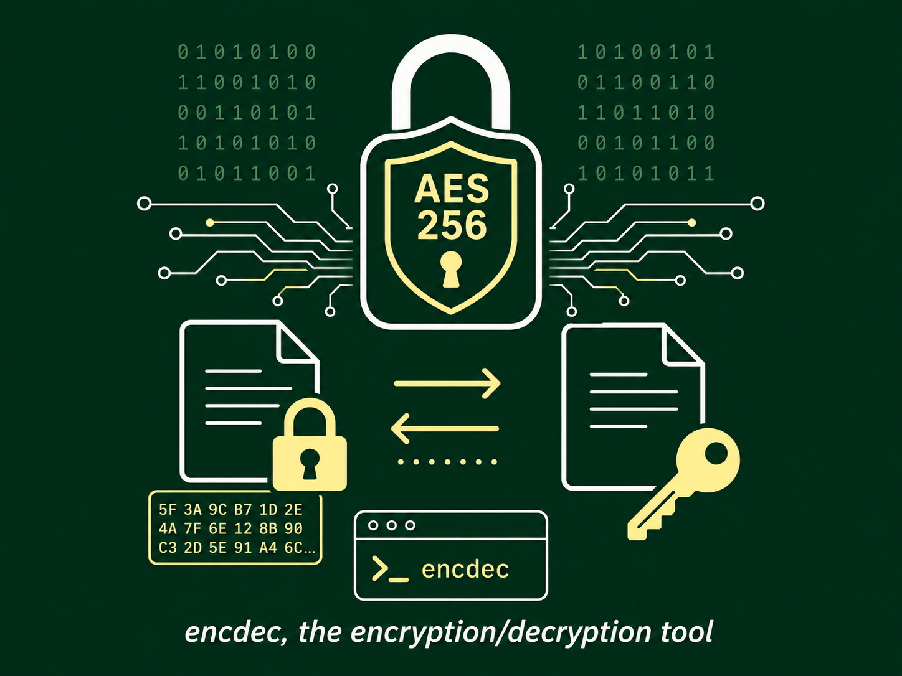

# encdec
___
A small command-line tool to **encrypt/decrypt strings and files** using AES-256 (CFB mode).

> A note on terminology: throughout this project the words *encode/encrypt* and *decode/decrypt*
> are used loosely and interchangeably. They are technically different things — this is a
> deliberate, non-pedantic shortcut, not a mistake.

---

## Overview

`encdec` operates in three modes:

- **String mode** (default): encrypts/decrypts a string passed as an argument, printing the
  result to stdout.
- **File mode** (`-f`): encrypts/decrypts a file on disk. The file is read in full, so memory
  usage is proportional to its size.
- **Directory mode** (`-d`): recursively encrypts/decrypts every regular file below a root
  directory, using the same in-place semantics as file mode on each one.

The cryptography itself is not implemented here: both modes delegate to
[helperFunctions](https://github.com/jeanfrancoisgratton/helperFunctions) (`v5`), which uses
AES-256 in CFB mode with a randomly generated IV prepended to the ciphertext, the whole being
emitted as standard Base64. Encrypted files are therefore Base64 *text*, not raw binary, and are
written with `0600` permissions.

## Usage

```
encdec {encode|decode} [flags] <string | file> [destfile]
```

Subcommands (with aliases):

| Command             | Alias | Description                          |
|---------------------|-------|--------------------------------------|
| `encode`            | `enc` | Encrypt a string, file, or directory |
| `decode`            | `dec` | Decrypt a string, file, or directory |
| `version`           |       | Show the software version            |

Flags:

| Flag              | Scope           | Description                                                        |
|-------------------|-----------------|-------------------------------------------------------------------|
| `-s, --secret`    | global          | Encryption/decryption passphrase; optional, of any length          |
| `-q, --quiet`     | global          | Print only the resulting string, no decoration                    |
| `--debug`         | global          | Show extra debug output                                           |
| `-f, --file`      | encode/decode   | Operate on a file instead of a string                             |
| `-d, --directory` | encode/decode   | Operate on a directory instead of a string (mutually exclusive with `-f`) |
| `-k, --keep`      | encode/decode   | Keep the original file instead of replacing it in place (in-place runs only) |
| `-F, --force`     | encode/decode   | Overwrite the destination file if it already exists               |

### String mode

```sh
encdec encode "some secret text"
encdec decode AAECAwQF...     # the Base64 blob produced above
```

The decoded/encoded string is written to stdout. Use `-q` to print just the raw value (handy
for piping into other commands).

### File mode (requires `-f`)

```sh
encdec encode -f secrets.txt              # encrypts secrets.txt in place
encdec encode -f -k secrets.txt           # keeps secrets.txt, writes secrets.txt.enc
encdec encode -f secrets.txt out.enc      # writes ciphertext to out.enc, secrets.txt untouched
encdec encode -f -F secrets.txt out.enc   # ... overwriting out.enc if it already exists
encdec decode -f secrets.txt              # decrypts secrets.txt in place
```

Behaviour with respect to the destination file:

- If **no destination** is given, encdec works **in place**: it writes to a scratch file
  (`<source>.enc` / `<source>.dec`) and then, unless `-k` is passed, removes the original and
  renames the result back to the original name. With `-k`, the original is left alone and the
  result stays under its `.enc`/`.dec` name.
- If a **destination** is given, the result is written there and the **source is left
  untouched**. `-k` has no effect in this mode — there is no in-place replacement to opt out of.
- An existing destination is **never overwritten** unless `-F, --force` is passed. This covers
  the scratch file of an in-place run too, so a leftover `foo.enc` from an aborted run will not
  be silently destroyed.

### Directory mode (requires `-d`)

```sh
encdec encode -d                 # encrypts every regular file under the current directory
encdec encode -d /path/to/dir    # encrypts every regular file under /path/to/dir
encdec decode -d -k /path/to/dir # decrypts in place, keeping each source file's .dec copy
```

`-d` walks the given root directory recursively (the current directory if none is given) and
applies the same in-place logic as file mode to every regular file it finds; symlinks and other
special files are left untouched. `-d` and `-f` are mutually exclusive. `-k` and `-F` behave
exactly as they do in file mode, applied per file.

### The passphrase

`-s` takes a **passphrase**, not a raw key: the 32-byte AES-256 key is derived from the SHA256 sum
of the passphrase, so any length works.

```sh
encdec encode -s "correct horse battery staple" "top secret"
```

The passphrase is **optional**. Omitting `-s` (or passing `-s ""`) uses the empty passphrase, which
is a perfectly valid one — the data still gets encrypted, but with a key anyone can reproduce. Use
it for scrambling, not for secrecy.

There is no recovery mechanism: if you lose the passphrase you used to encrypt something, the data
is unrecoverable, so store it safely. Note as well that CFB mode is unauthenticated — decrypting
with the wrong passphrase yields garbage rather than an error.

> **Format change in 1.5.0:** the on-disk/on-wire format changed when encryption moved to
> `helperFunctions`. Data encrypted by 1.4.1 or earlier **cannot** be decrypted by 1.5.0 and later.
> Decrypt anything you still care about with the old binary before upgrading.

## Build & Install

You can build from source or grab a pre-built package.

### From source

Requirements: a Go toolchain (see `src/go.mod` for the version) and Git.

```sh
git clone https://github.com/jeanfrancoisgratton/encdec.git
cd encdec/src

./updateBuildDeps.sh   # optional: refresh module dependencies
./build.sh             # builds and installs the binary
```

By default `build.sh` compiles a stripped, trimmed static binary
(`CGO_ENABLED=0`, `-ldflags="-s -w"`) into `/opt/bin`. You can override the destination:

```sh
./build.sh /usr/local/bin      # install elsewhere
./build.sh -b mytool /opt/bin  # override the binary name
```

### Binary packages

Packaging scripts and specs are provided for several distributions:

- **Alpine** — `__alpine/` (APKBUILD)
- **Arch Linux** — `__archlinux/` (PKGBUILD)
- **Debian** — `__debian/`
- **RedHat / RPM** — `__redhat/`
- **Windows** — `__windows/` (cross-compiled `.exe` packaged into a `.msi`)

These build recipes depend on the author's own build containers and are not guaranteed to work
out of the box elsewhere. As an easier alternative, pre-built packages are published at:

<https://github.com/jeanfrancoisgratton/encdec/releases>

## License

Released under the **GNU General Public License v3** — see [docs/LICENSE](docs/LICENSE).

## Author

Jean-François Gratton — <jean-francois@famillegratton.net>
